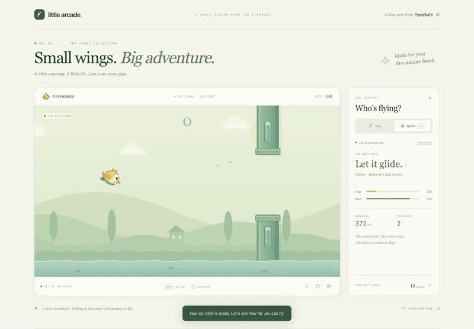

# Jev Bird 🐤

**Two buttons for an AI. Somehow, still plenty of ways to hit a pipe.**

A tiny Flappy Bird-style arcade game where you can fly yourself or hand the wings to [TypeSafe Jev](https://typesafe.ai). A golden canary, a sunny canal, and one very important decision: **FLAP or WAIT?**



**Jev takes the controls:** 10 pipes, 69 decisions, one real-time flight. Recorded with live TypeSafe API calls—no manual flaps or mocked answers.

## The idea

What happens when an AI has to play a game that won't wait for its answer?

Jev doesn't pause the world to think. Gravity keeps working while the request travels. The game projects five possible futures—200, 350, 500, 650, and 800 milliseconds ahead—and asks Jev what to do in each. When the answers land, it picks the one closest to the elapsed game time.

Local physics supplies the forecasts and action previews. **Jev chooses the move.** The network is an unofficial third player.

## The fun bits

- **You vs. Jev:** separate best scores, the same seeded course, equally unforgiving pipes.
- **Watch the decisions:** live FLAP/WAIT probabilities, response time, and a running decision count. Confidence is not collision insurance.
- **Peek under the wing:** inspect the bird's state and the geometry behind the next move.
- **A little arcade, not a dashboard:** animated water, a golden bird, optional sound, and tap-to-flap on mobile.
- **Real AI calls, real crashes:** Auto isn't a scripted perfect run. Late answers and bad choices are part of the experiment.

## Take a flight

With **Node.js 22+**:

```sh
git clone https://github.com/betty2310/jev-bird.git
cd jev-bird
npm start
```

Open **http://127.0.0.1:3000**. No dependencies to install or build step.

**Space, click, or tap** to fly. **P / Escape** to pause. **R** to restart.

To give Jev a turn, choose **Auto**, enter your [TypeSafe API key](https://console.typesafe.ai), select **Connect Auto**, then **Let Jev fly**. Manual play needs no key; Auto makes API calls that may incur charges. Your key stays in browser memory and is forwarded through the local server to TypeSafe; it isn't saved to browser storage or logs. Disconnect or reload to clear it.

Small wings. Big latency. Just one more pipe.
