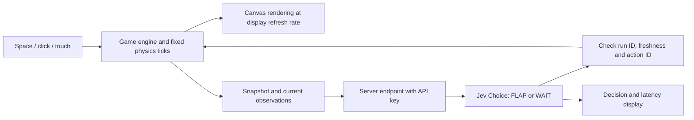

# Jev + Flappy Bird: feasibility and design

Researched and measured on 2026-09-19, before implementation. This note preserves the initial experiments and proposals. The playable game is now implemented; see the [current game README](../README.md) for its two modes, API-key flow, and run instructions.

The idea is feasible as an experiment: run a normal game and ask Jev to choose `FLAP` or `WAIT` from a serializable state. The measured API delay and state representation matter more than the two-option output interface. Start with readable observations alongside the numeric state, adjustable game speed, and visible comparisons against raw state and a local controller.

## What the current API supports

- The version tested was `jev-1.13.0`, confirmed in every response. The current documentation maps both `jev-latest` and `jev-preview` to this version. Pin the version for comparisons.
- `POST https://api.typesafe.ai/v1/systemone` accepts `state`, `model`, and typed `questions`. A `choice` question can return exactly `FLAP` or `WAIT`, plus their probabilities and a confidence value.
- Jev accepts text and structured JSON, not game screenshots. Exposing state directly is a suitable input design.
- Current published pricing is **$0.042 per million input tokens**, with free output tokens. Published limits are 1,200 requests/minute and 250,000 tokens/second, and the provider says these can change.
- TypeSafe explicitly identifies numeric precision as a weakness and recommends doing arithmetic in code. Keep gravity, collisions, geometry comparisons, and timers in the engine.
- Confidence summarizes the model's answer distribution. It is not the probability of surviving the next pipe, and a confidence threshold needs evaluation on this game.

Sources: [Models](https://docs.typesafe.ai/models), [HTTP API](https://docs.typesafe.ai/api), [Choice](https://docs.typesafe.ai/primitives/choice), [State](https://docs.typesafe.ai/concepts/state), [known limitations](https://docs.typesafe.ai/model-jaggedness/jev-1.13), [confidence](https://docs.typesafe.ai/confidence). The [function-calling cookbook](https://docs.typesafe.ai/cookbooks/function_calling) is the closest integration pattern: select a fixed action and let application code execute it.

## Measurements from this machine

128 inference requests total: 120 measured requests and 8 warmup requests. No retries, no concurrency, and no HTTP errors. Each request used one Choice question. End-to-end latency runs from immediately before Node's `fetch` until the complete response body has been read. It includes network, service processing, and response transfer; it is not an isolated inference time and does not include a future browser-to-server hop.

| Input representation | Measured requests | Median | p95 | Maximum | Correct immediate action |
| --- | ---: | ---: | ---: | ---: | ---: |
| Raw numeric state and physics | 40 | 321.9 ms | 385.3 ms | 451.2 ms | 25/40 (62.5%) |
| Raw state + current spatial/motion descriptions | 40 | 325.9 ms | 385.4 ms | 509.8 ms | 40/40 |
| Raw state + engine-calculated action outcomes | 40 | 323.2 ms | 414.7 ms | 501.6 ms | 40/40 |

The first request of each process took **862.5 ms** and **787.0 ms**. The second request in each process was also slower than subsequent requests. These measurements do not separate connection startup, server behavior, and other causes.

All 120 measured requests exceeded 200 ms. A sequential loop at the measured mean latency supports approximately **3 decisions/second**. At 60 FPS, a response arriving after 322 ms is already about **19 frames old**. A 415 ms response is about **25 frames old**.

The API reported **108,070 input tokens** across the 128 calls. At the published input price, their estimated cost is **$0.00454**, not a verified billing total. At a hypothetical sustained 3 decisions/second, the observed average payload sizes imply approximately **$0.34–$0.41 per hour** of active play. Request frequency, prompt size, and future pricing affect that estimate.

### How to interpret the action checks

These are **eight hand-designed danger situations with five small perturbations each**, not 40 independently sampled games. The scenarios cover the floor, ceiling, upper/lower pipe edges, and approaches from above/below an opening. Half require FLAP and half require WAIT.

The benchmark applies an action immediately to the saved snapshot, then permits no additional flap for 300 ms. Constant-acceleration positions are calculated locally, with circle/rectangle collisions sampled at 240 Hz. Each fixture begins alive and has exactly one action that avoids collision for the whole horizon. The fixtures have generous collision margins; this is not a production swept-collision implementation.

The raw-state and forecast variants were paired and interleaved. The observation variant was a separate follow-up on the same 40 states, so small latency differences should not be attributed to representation alone.

The observation variant adds facts such as “falling; speed is fast,” “inside opening, near its lower edge,” and “overlapping bird horizontally now.” When the bird extends outside the opening, it also describes the direction it needs to move to fit. These are geometric interpretations computed by code. It supplies no action label and no simulated action outcome. This is still more assistance than raw state.

The forecast variant includes explicit collision outcomes for both actions. Its 40/40 result only demonstrates that Jev can select the supplied safe outcome: the engine has already solved that narrow collision decision. A deterministic selector can achieve the same result locally.

**None of these numbers is a live-game survival rate.** Network delay was measured but not applied to the action checks. Indeed, median latency exceeds the 300 ms evaluation horizon. Timing, moving-state errors, longer-term planning, and unfamiliar situations still require a playable closed-loop evaluation. Perfect performance on this small constructed set does not establish general reliability.

Raw records, including synthetic request states, answers, token usage, and per-request timing:

- [Raw state versus forecasts](results/jev-2026-09-19T15-13-23.003Z.json)
- [Current observations follow-up](results/jev-2026-09-19T15-15-04.291Z.json)

## Proposed game architecture



Use a pure JavaScript/TypeScript engine shared by the visual game, replay tools, and local baseline. Canvas is sufficient for the bird, pipes, and particles. A small Node server can hold the TypeSafe key and call the documented HTTP API or the [official JavaScript SDK](https://docs.typesafe.ai/sdk/javascript). Keep the API key out of client bundles.

Expose the complete game state for inspection and deterministic replay. Send Jev a compact projection containing all decision-relevant physics, rather than textures, particle arrays, and interface state. Initially include the bird, world boundaries, and the next two relevant pipe pairs. If an old pipe still overlaps the bird, keep it in the snapshot until it is fully cleared.

Suggested state contract:

```ts
type Action = 'FLAP' | 'WAIT';

type DecisionState = {
  runId: string;
  frameId: number;
  simulationTimeMs: number;
  coordinateSystem: 'pixels; positive y is down';
  bird: { x: number; y: number; vy: number; radius: number };
  world: {
    ceilingY: number;
    floorY: number;
    gravityY: number;
    flapVelocityY: number;
  };
  control: { flapAvailable: boolean; timeSinceLastFlapMs: number };
  pipes: Array<{
    id: string;
    x: number;
    width: number;
    vx: number;
    gapTop: number;
    gapBottom: number;
  }>;
  observations: {
    verticalMotion: string;
    floorProximity: string;
    ceilingProximity: string;
    birdRelativeToGap: string;
    nextPipeHorizontalRelation: string;
  };
};
```

Wall-clock request timestamps should also be kept locally for latency and freshness checks. A server response should echo the request's run/frame ID in its application envelope; do not ask Jev to invent those fields. If wind, moving gaps, jets, or cooldowns are introduced, expose their real state and transition rules too.

Operational choices:

1. Run physics on fixed ticks and render independently. An HTTP request must not block the animation loop.
2. Begin with one request in flight. When it finishes, snapshot the current state for the next call. Never build a queue of old snapshots.
3. Apply FLAP once through the same game action used by the space key. WAIT means no impulse. Never repeat the last FLAP on every render frame.
4. Tag requests with a run ID and action ID. Discard responses from a previous run or an already-applied request; reject stale actions using a tested freshness budget.
5. Warm up before the countdown. Offer 0.25×, 0.5×, and 1× simulation speed. At 0.25×, the measured 322–415 ms delay represents about 80–104 ms of game time; this is a useful starting experiment, not a proven successful setting.
6. Handle timeouts and service failures explicitly. WAIT is not universally safe. Raw Jev mode can continue under gravity and record the failure; assisted mode can invoke a labeled local controller. Do not silently blend the modes when comparing scores.
7. An assisted mode can forecast the state at expected response arrival and re-check the proposed action against current geometry. Measure how often local code overrides Jev.

For the eventual live prompt, define the expected action horizon and delay assumption using measured timing. The benchmark's immediate-action, 300 ms instructions are an evaluation fixture, not a ready-to-use live policy.

## Bird and water-pipe concepts

My starting choice is **Pipeworks Canary**: a round golden bird with a tiny blue pilot scarf, flying through teal water pipes above a canal. A warm off-white sky and deep blue outlines give the bird a clear silhouette. Pipes have chunky collars, bolts, and small glass sections with animated water inside. The bird's wing, squash, and tilt respond to flaps and velocity; its collider stays stable. Cosmetic droplets fall outside the playable gap. A crash into the canal makes a quick splash and opens the retry screen.

| Concept | Bird | Pipes and setting | Best fit |
| --- | --- | --- | --- |
| Pipeworks Canary | Golden canary with a scarf | Teal plumbing, glass water windows, a canal | Clear, cheerful default |
| Bath-time Flight | Tiny yellow duck with fluttering wings | Chrome taps, pastel drain pipes, soap bubbles | Playful and soft |
| Garden Courier | Coral hummingbird | Bamboo irrigation pipes, leaves, small waterfalls | Calm outdoor style |

Start with fixed pipe gaps and decorative water. Make the gap boundaries and collision surfaces visually obvious, and keep splash particles separate from the hitbox. Use seeded generation and bounded changes in gap height so difficulty and comparisons are repeatable.

Later mechanics could include slowly moving valve openings, periodic water jets, or wind near a vent. Add one at a time, telegraph the hazard visually, and expose its phase, velocity, and next transition time in state. These would test whether Jev can use changing conditions, but they should follow a working static-pipe baseline.

A compact observation panel can show `FLAP / WAIT`, both option probabilities, the last response time, state age, and a toggle for the raw JSON. Use engine-derived event labels for explanations, such as “falling near lower edge”; Jev does not generate a reasoning trace. A faint ghost path can visualize local trajectory calculations when the assisted mode is selected.

## Recommended first playable experiment

Build one attractive, playable course with space/click/touch controls, score, collision, restart, seeded pipes, and speed control. Add four visible modes: **Human**, **Jev raw**, **Jev with observations**, and **Local controller**. Add **Jev assisted** separately if we want to explore prediction and fallback behavior.

Compare repeated runs on held-out pipe seeds at each speed. Record pipes passed, survival time, cause of death, response latency, age at action application, rejected stale responses, request failures, and local overrides. Use the same physics and seeds across modes. Do not stop simulation while awaiting a response when reporting real-time performance; a separate step-through debugger can deliberately pause.

The current evidence supports trying Jev with current-state observations first. It does not yet support claiming that raw Jev can reliably play normal-speed Flappy Bird.

## Reproduce the benchmark

Requires Node 22+ and `.env` containing `TYPESAFE_API_KEY`. Commands below follow this workspace's RTK convention. No packages need to be installed.

```sh
rtk proxy node research/benchmark-jev.mjs --dry-run
rtk proxy node --env-file=.env research/benchmark-jev.mjs
rtk proxy env JEV_BENCH_VARIANTS=with_observations node --env-file=.env research/benchmark-jev.mjs
```

Optional environment variables: `TYPESAFE_MODEL`, `JEV_BENCH_SAMPLES` (default 40, maximum 200), and `JEV_BENCH_VARIANTS` (comma-separated `raw_state`, `with_observations`, `with_forecasts`). To compare all three interleaved, set `JEV_BENCH_VARIANTS=raw_state,with_observations,with_forecasts`.

The script uses a fixed official API endpoint, refuses redirects, does not retry, and stops on authentication, rate-limit, or overload responses. Each run writes a timestamped JSON report under `research/results/`. Credentials and server error bodies are never written to those reports.
